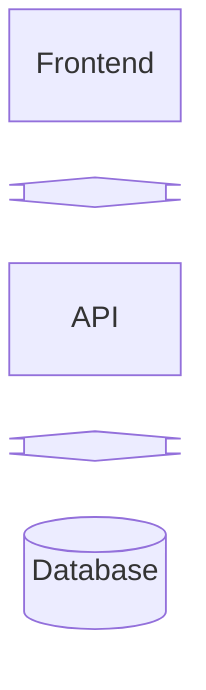

# User Guide

Quick Start

```sh
./docker/db-seed
./docker/app-start
```

UI <http://localhost:4200>  
API <http://localhost:3000/api-docs>

## Application Structure

### Folders

```text
├── backend
│   ├── api             # Business logic and API
│   └── database        # Database layer
│       ├── csv_seed    # CSV seed data in schema form
│       ├── scripts     # db scripts
│       └── sql         # SQL statements used by the db scripts
├── configure
│   ├── csv_raw         # CSV source data
│   ├── generate-schema # use to generate the schema from CSV source data
│   ├── schema_csv      # CSV seed data in schema form
│   ├── schema_json     # JSON data schema
│   ├── using-csv       # use to generate the application, schema, and seed data
│   └── using-schema    # use to generate the application, and seed data
├── docker              # docker scripts and helpers
├── frontend            # Presentation layer
├── db_data             # Database mount point, contains the DB data
└── tmux                # native scripts running inside tmux
```

### Logical App Stack



## Scripts

### Docker

```sh
# checks for docker, then runs any docker command
./docker/-cmd

calls docker compose using the default yaml file
./docker/-compose

# runs a docker command against the api container
# e,g, ./docker/api sh
./docker/api

# CAUTION: removes all docker artifacts
./docker/app-purge

# starts the app
./docker/app-start

# starts the api and db
./docker/backend-start

# starts the ui
./docker/frontend-start

# stops the app
./docker/app-stop

# stops the api and db
./docker/backend-stop

# stops the ui
./docker/frontend-stop

# used by ./docker/-compose
compose-vol-service.yaml
compose-vol-shared.yaml

# runs a docker command against the db container
# e.g. ./docker/db sh
./docker/db

# opens the psql terminal in the db docker
./docker/db-psql

# (re) creates the db tables and seeds the tables with CSV data
./docker/db-seed

# starts the db container
./docker/db-start

# stops the db container
db-stop

# runs a docker command against the ui container
# e.g. ./docker/ui sh
./docker/ui
```

### Native (depends on tmux / mise)

```sh
# CAUTION: recursively search and remove node artifacts
mise app-node-purge

# Starts the db docker container, and runs the api and ui natively
# (requires tmux)
./tmux/app-start

# (requires mise and tmux)
mise app-start

# Stops the db docker container, and shutdown the api and ui
# (requires tmux)
./tmux/app-stop

# (requires mise and tmux)
mise app-stop
```


## Application runtime

### UI Pages

<http://localhost:4200>

### API Endpoints (Swagger/OpenAPI docs)

<http://localhost:3000/api-docs>

### Database

```sh
./docker/db-psql
```

```postgres
--- get tables
\dt
-- get sequence tables
\ds
```

### Database Admin (adminer)

<http://localhost:8080>

Default login

```
System      PostgresSQL
Server      database
Username    postgres
Password    password
Database    postgres
```
